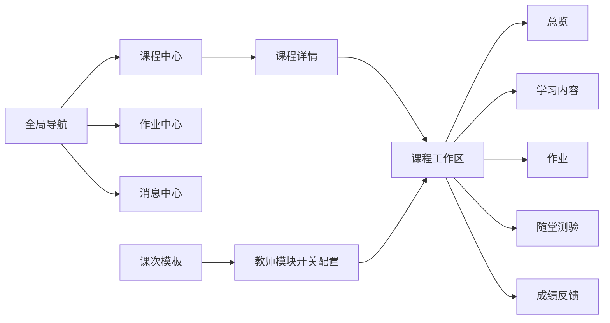
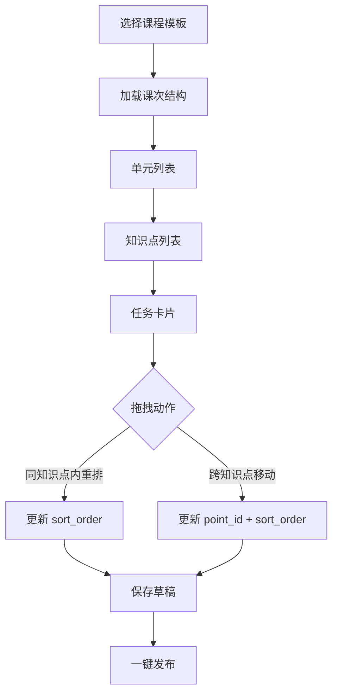
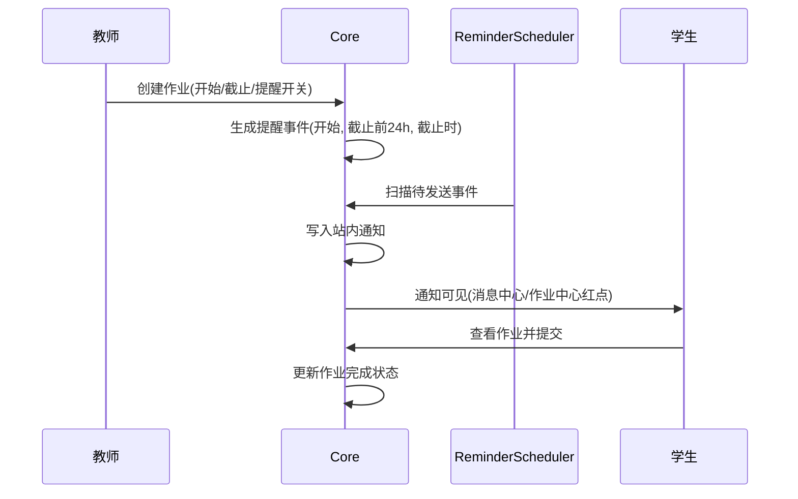

# 课堂工作区与作业提醒架构

本页用于约束“课堂模板 + 拖拽编排 + 作业中心 + 三时点提醒”的整体实现方案，保证后续前后端迭代一致。

## 1. 交互原型结构图

### 1.1 全局导航与课程工作区

### 1.2 教师课堂编排器（拖拽排序）

### 1.3 学生作业流与提醒流

## 2. 角色视图约束

- 教师：默认展示“编排 + 发布 + 监控 + 批阅”。
- 学生：默认展示“待完成 + 即将截止 + 已提交反馈”。
- 同一课程路径保持一致，差异仅体现在可见菜单项与操作按钮。

## 3. 后端接口清单（目标）

- 课程工作区模块配置
  - `GET /api/v1/courses/{courseId}/workspace/modules`
  - `PUT /api/v1/courses/{courseId}/workspace/modules`
- 课程学习结构编排
  - `PATCH /api/v1/courses/{courseId}/learning/points/{pointId}/tasks/order`
- 作业中心
  - `GET /api/v1/courses/{courseId}/homeworks`
  - `GET /api/v1/homeworks/mine`
- 站内提醒收件箱
  - `GET /api/v1/notifications`
  - `PATCH /api/v1/notifications/{notificationId}/read`
  - `PATCH /api/v1/notifications/read-all`

## 4. 数据表变更草案

### 4.1 学习任务扩展（作业字段）

在 `course_learning_tasks` 增加：

- `task_kind`: `LEARNING` / `HOMEWORK`
- `start_at`: 作业开放时间
- `due_at`: 作业截止时间
- `notify_on_start`: 作业开始时提醒
- `notify_before_due_24h`: 截止前 24 小时提醒
- `notify_on_due`: 截止时提醒

### 4.2 课程工作区模块配置

新增 `course_workspace_modules`：

- `course_id`
- `module_key`（如 `LEARNING`, `HOMEWORK`, `QUIZ`）
- `enabled`
- `sort_order`

约束：`(course_id, module_key)` 唯一。

### 4.3 站内通知与提醒事件

新增 `inbox_notifications`：

- `user_id`
- `notification_type`
- `title`
- `content`
- `action_path`
- `read_at`
- `delivered_at`

新增 `homework_reminder_events`：

- `task_id`
- `target_user_id`
- `trigger_type`（`START` / `BEFORE_DUE_24H` / `DUE`）
- `scheduled_at`
- `sent_at`
- `canceled`

约束：`(task_id, target_user_id, trigger_type)` 唯一。

## 5. 调度与幂等策略

- 调度器按分钟扫描 `scheduled_at <= now and sent_at is null and canceled = false` 的事件。
- 发送成功后写入 `sent_at`。
- 提醒事件键唯一，防止重复发送。
- 作业时间变更时重排提醒事件（取消旧事件并生成新事件）。

## 6. 迭代边界

- 第一版先支持“同知识点内拖拽重排 + 作业独立汇总 + 三时点站内提醒”。
- 第二版再支持“跨知识点拖拽移动 + 课次级模板复用 + 更多提醒策略”。